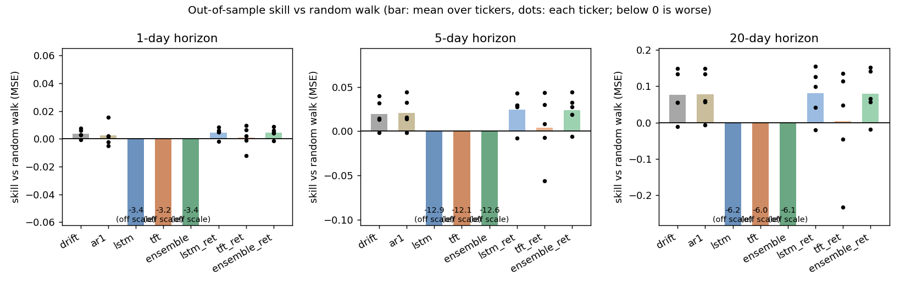
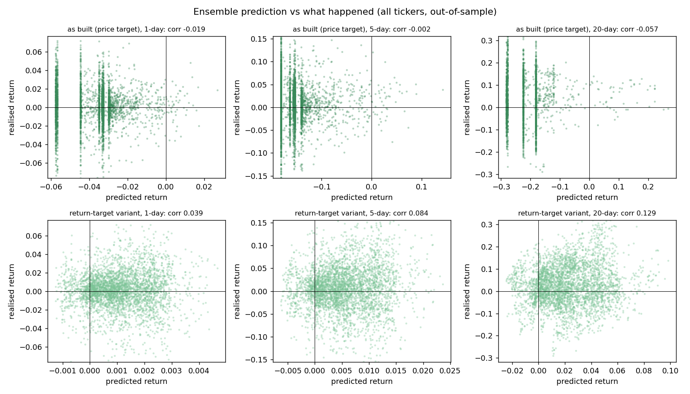

# Financial World Simulation

A local pipeline that tries to reason about a stock portfolio the way several different tools would: it reads financial news sentiment, forecasts each ticker's price with two neural network architectures, simulates a crowd of trading agents reacting to those forecasts, and runs a Monte Carlo risk analysis over the result. Everything is viewable in a Streamlit dashboard.

I wanted to see whether I could combine a few separate ideas I'd been reading about (sentiment analysis on news, sequence models for price forecasting, agent-based modeling, and Monte Carlo risk metrics) into one pipeline that all feeds into the same portfolio, instead of building each one as an isolated toy example.

## What it does

The portfolio itself is just an example. `config.py` ships with a fictional allocation across eight tickers spanning semiconductors, pharma, defense, energy, banking, and gold, clearly labeled as an example to edit with your own holdings. The point of the repo isn't that specific allocation, it's the pipeline that runs on top of whatever allocation you put there.

Running `main.py` walks through six stages. Data ingestion pulls OHLCV price history from `yfinance`, macro series from FRED, financial news from Marketaux (if you have a key) or RSS feeds otherwise, geopolitical tension scores from GDELT, and the USD/EUR rate from frankfurter.app, all cached in a local SQLite database so repeated runs are faster. Sentiment analysis scores headlines with FinBERT (`ProsusAI/finbert`, downloaded from Hugging Face on first use) and builds a rolling sentiment index per ticker. Event generation stochastically triggers geopolitical and macro scenarios, such as rate cuts, tariff escalation, or an AI-bubble-burst scenario tied to P/E ratios, using per-ticker impact ranges defined in `config.py`. ML forecasting trains an LSTM and a simplified Temporal Fusion Transformer per ticker and blends their outputs with a historical baseline. Agent-based simulation runs a population of trading agents split across seven behavioral archetypes, trading based on sentiment, momentum, and the triggered events. Portfolio analytics then runs a Monte Carlo simulation over the combined signals to get Value-at-Risk, Conditional VaR, Sharpe ratio, an efficient frontier, and rebalancing suggestions.

The Streamlit dashboard (`modules/dashboard.py`) visualizes all of this: a donut chart of the allocation, fan charts of the Monte Carlo paths per horizon, an event impact waterfall and heatmap, an efficient frontier plot, a rebalancing panel, and a PDF export of the summary (via `reportlab`, if installed).

## How it works

### Sentiment

`sentiment_engine.py` loads FinBERT lazily the first time it's needed and scores each headline in batches. Headlines are matched to tickers using a keyword watchlist (for example, "Jensen Huang" and "Blackwell" for NVDA), then aggregated into a rolling sentiment score per ticker over time.

### Forecasting

`ml_forecasting.py` builds two PyTorch models per ticker on top of about twenty technical indicators, plus sentiment, macro, and cross-asset features such as gold, oil, the SOX index, the dollar index, and the 10-year yield.

`LSTMForecaster` is a 2-layer LSTM with dropout left active at inference time, so running it multiple times gives a Monte Carlo dropout estimate of uncertainty rather than a single point forecast. `SimplifiedTFT` is a smaller version of a Temporal Fusion Transformer, with a variable-selection network that learns which input features matter most and gated residual blocks, outputting several forecast quantiles directly.

The two models' outputs get ensembled together, and the pipeline logs simple validation metrics per horizon (directional accuracy, mean absolute error) so you can see how well a given ticker's forecast actually did against history rather than just trusting the number. Longer horizons are deliberately shrunk toward the historical baseline and volatility is capped, because a 365-day neural network price forecast on noisy financial data is not something I'd take literally. I treat these as scenario ranges, not predictions.

### Agent-based simulation

`agent_simulation.py` assigns each of up to 50,000 simulated agents to one of seven archetypes defined in `config.py`: retail investors chasing momentum, slower passive retail, fundamentals-driven institutions, a fast quant/algo trader, macro-focused hedge funds, sovereign or central-bank-style actors, and insiders who trade around earnings. Each archetype has its own risk tolerance distribution, memory horizon, reaction delay, and herding coefficient, so the same sentiment shock produces different behavior across the population instead of everyone reacting identically.

### Risk analytics

`portfolio_analytics.py` runs a Monte Carlo simulation over the combined forecast and agent signals and computes VaR and CVaR at the 95% and 99% confidence levels, an annualized Sharpe ratio, maximum drawdown, and an efficient frontier via `PyPortfolioOpt`. It also checks for concentration risk: in the example portfolio, the three semiconductor names make up a large fraction of the allocation, and the analytics flag that correlation explicitly rather than treating each ticker as independent.

## Running it

```bash
pip install -r requirements.txt
```

API keys are optional. Copy `.env.example` to `.env` and fill in `FRED_API_KEY` and `MARKETAUX_API_KEY` if you have them. Without them, the pipeline falls back to synthetic macro data and RSS-only news, so it still runs end to end.

```bash
# Quick test with reduced agents and Monte Carlo paths
python main.py --dry-run

# Full pipeline (defaults: 50,000 agents, 10,000 Monte Carlo paths, 30/60/90/365-day horizons)
python main.py

# Custom parameters
python main.py --agents 10000 --mc-paths 5000 --horizons 30 60 90
```

Then launch the dashboard:

```bash
python -m streamlit run modules/dashboard.py
```

The first full run downloads FinBERT (a few hundred MB from Hugging Face) and trains the LSTM/TFT models per ticker, which takes a while on CPU. Later runs reuse the saved checkpoints and cached data, so they're much faster. `--dry-run` is meant for iterating on the code without waiting for the full pipeline each time.

## Evaluation

I wanted to know whether the forecasting models are better than doing nothing, so `evaluate_forecasts.py` runs a walk-forward test against naive baselines. For each ticker it uses three expanding-window folds. In each fold the scalers and both networks are fit only on the days before the cutoff and then scored on the next 252 trading days, which they never saw. It uses price-only features from `build_features()` (no sentiment, macro or cross-asset inputs), so it runs without any API keys, and prices come from yfinance (cached in `data/eval_cache/`, which is gitignored). It does not touch the checkpoints in `models/`.

The baselines are a random walk (predict a return of zero), the historical mean return (drift, using only returns up to the forecast date) and an AR(1) model fit on the training window. The metrics are RMSE of the horizon return, directional accuracy, and a skill score, 1 - MSE(model) / MSE(random walk), where a positive number means better than predicting zero.

What I actually ran: NVDA, JPM, NEM, LLY and NOC; horizons of 1, 5 and 20 trading days; forecast origins from 2023-09-28 to 2026-10-02; at most 12 epochs per network with early stopping (patience 3); seed 42. I used five tickers and short training so it finishes on a CPU laptop in roughly 15 to 20 minutes, so treat it as a small experiment and not a full study. The test origins are daily, so the 5 and 20 day targets overlap and the samples are not independent.

I ran two versions of the networks. "As built" follows the pipeline: the target is the next-day Close price and the features include price-level indicators. "Return target" is the same two networks trained on the next-day return with ratio-only features. Averages over the five tickers (the last column counts tickers with positive skill):

| horizon (days) | model | RMSE | directional accuracy | skill vs random walk | tickers beating random walk |
|---|---|---|---|---|---|
| 1 | random walk | 0.0218 | n/a | 0.0000 | - |
| 1 | historical mean (drift) | 0.0217 | 54.3% | 0.0037 | 4/5 |
| 1 | AR(1) | 0.0217 | 53.5% | 0.0024 | 3/5 |
| 1 | LSTM+TFT ensemble, as built | 0.0446 | 45.7% | -3.3531 | 0/5 |
| 1 | LSTM+TFT ensemble, return target | 0.0217 | 53.2% | 0.0045 | 4/5 |
| 5 | random walk | 0.0488 | n/a | 0.0000 | - |
| 5 | historical mean (drift) | 0.0483 | 58.1% | 0.0196 | 4/5 |
| 5 | AR(1) | 0.0482 | 58.0% | 0.0208 | 4/5 |
| 5 | LSTM+TFT ensemble, as built | 0.1687 | 42.3% | -12.5805 | 0/5 |
| 5 | LSTM+TFT ensemble, return target | 0.0482 | 56.1% | 0.0235 | 4/5 |
| 20 | random walk | 0.0970 | n/a | 0.0000 | - |
| 20 | historical mean (drift) | 0.0930 | 61.0% | 0.0768 | 4/5 |
| 20 | AR(1) | 0.0929 | 61.0% | 0.0786 | 4/5 |
| 20 | LSTM+TFT ensemble, as built | 0.2514 | 39.8% | -6.1021 | 0/5 |
| 20 | LSTM+TFT ensemble, return target | 0.0928 | 58.5% | 0.0795 | 4/5 |





The plain result is that the forecasters as I built them do not beat the random walk. The as-built ensemble is far worse on every ticker and horizon, with directional accuracy below 50%. The scatter plot shows that its predictions pile up at a few large negative values. My reading, which I have not tested separately, is that because the target is a price level and these stocks mostly trade above their training-window range, the standardised inputs fall outside what the networks saw, so they output near-constant numbers that the pipeline's caps then clip. This is a design problem in how I framed the target, and it likely affects the price forecasts that feed the rest of the pipeline too.

The return-target version fixes that and ends up level with the simple baselines, but not clearly ahead of them. Its skill score is almost the same as the drift and AR(1) baselines, and I think most of the small positive number comes from the test period being a rising market in which a positive mean beats a prediction of zero, not from the networks finding a pattern. I have not tested whether the gap to the drift baseline is statistically meaningful, and with five tickers I would not claim it is. Directional accuracy for drift and the return-target ensemble is above 50% mostly because most of these days and weeks were up.

This is not a surprising result. Daily equity returns are close to unpredictable because prices already reflect public information, the signal-to-noise ratio is tiny, and a network with many thousands of parameters trained on a few thousand noisy days will mostly fit noise. The honest use of the forecasts is as scenario ranges, as I said above, and the full per-ticker tables are in `docs/forecast_eval_results.md` and `docs/forecast_eval_results.csv`.

To rerun it:

```bash
# default settings used for the table above (roughly 15 to 20 minutes on a CPU)
python evaluate_forecasts.py --tickers NVDA JPM NEM LLY NOC --folds 3 --epochs 12 --patience 3

# quick smoke run
python evaluate_forecasts.py --tickers JPM --folds 1 --epochs 3 --out-dir /tmp/eval_check
```

## Tests

The deterministic parts have a pytest suite that needs no network or API keys: VaR and CVaR against the analytic normal values, Sharpe and max drawdown on hand-computed series, Monte Carlo seeding, portfolio weights summing to 1, agent counts and seeding, and the evaluation metrics and baselines (including a check that the drift baseline cannot see the future and that scalers are fit on the training window only). Writing them turned up one bug: `compute_sharpe` returned infinity for a constant return series because of a rounding-sized standard deviation, and it now returns 0.

```bash
pip install pytest
python -m pytest tests
```

## What I'd flag as limitations

The price forecasts should not be read as predictions anyone should trade on. They're built from public OHLCV history, news sentiment, and a handful of macro series, over a market that reacts to far more than that. The agent-based simulation is a simplification of how real markets aggregate information; the archetypes and their parameters are hand-tuned guesses at plausible behavior, not calibrated against real trading data. Geopolitical event probabilities in `config.py` are also just estimates I set myself, not derived from any model. I built this as a way to combine several techniques in one pipeline and see how they interact, not as a forecasting tool to rely on.
